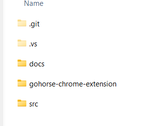
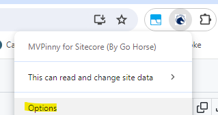
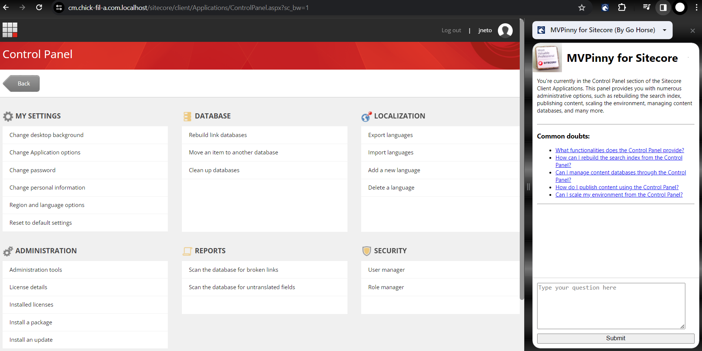
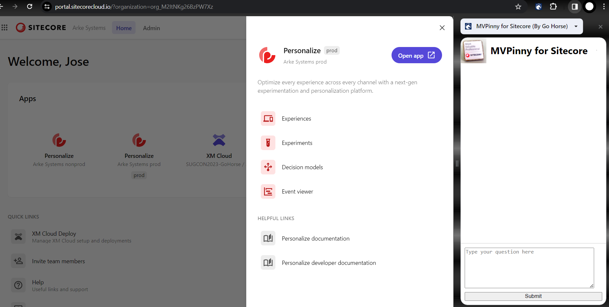

# MVPinny for Sitecore

## Team name
⟹ **Go Horse**
  - Anderson Fortaleza
  - José Neto
  - Rodrigo Peplau

<br/>

## Category
⟹ Best use of AI

## Description
  - Module Purpose: <br/>
    - This tool serves as a chat assistant specifically designed for content editors working with Sitecore. Its primary purpose is to facilitate a comprehensive understanding of Sitecore features on the fly. Users can inquire about any aspect of the tool, and it is seamlessly connected to MVPinny, an AI model specialized in Sitecore, skillfully developed by the Go Horse Team.

  - How it works<br/>
    - This Chrome extension module resolves and supports content editors by seamlessly integrating Sitecore with artificial intelligence. It aids content authors by directly delivering answers to their questions.

## Video link
⟹ Provide a video highlighting your Hackathon module submission and provide a link to the video. You can use any video hosting, file share or even upload the video to this repository. _Just remember to update the link below_

⟹ [Replace this Video link](#video-link)


## Pre-requisites and Dependencies

- Chrome Browser 
- Compatible with any Sitecore version (XP, XM and XM Cloud)

## Installation instructions

1. Install Chrome Browser

2. Clone this repository, or download the ZIP and uncompress it <br/>

3.  Open Google Chrome

4.  Navigate to the Chrome Extensions Management Page <br/>
In the address bar, type
```extensions
chrome://extensions/
```
and press Enter.<br/>

6. Enable Developer Mode<br/>
In the top-right corner of the Extensions page, toggle the "Developer mode"<br/>
switch to the ON position.<br/>

<br/>

6. Click on the "Load unpacked" button.<br/>

<br/>

7. Select Extension Folder<br/>
A file dialog will appear. Navigate to the folder where your locally hosted extension is located, navigate to the "gohorse-chrome-extension", then click "Select Folder" or "Open."<br/>
<br/>

8. Now you should see the "MVP for Sitecore Settings"<br/>
Fill the "OpenIA Key" field with your OpenAI API Key, and select the "model", then click "Save"<br/>
<br/>

⟹ If you don't have an API KEY, click on the document below <br/>
- [Creating API Key instructions](CreatingAPIkey.md)<br/>
⟹ Your OpenAI account must support the gpt-4, if it doesn't select the gtp-3.5

9. Make sure you can see the module listed on chrome extensions page<br/>
<br/>

10. For your convenience, pin the extension to your toolbar.<br/>
Once you click "Extension button" add the "MVP Pinny for Sitecore"(By Go Horse), <br/>
you will see the plugin on your bar<br/>
 <br/>

### Configuration
The critical setup involves the selection of both the "OpenAI Key" and the "model." However, they were already configured in previous steps.<br> If necessary, these selections can be modified by right-clicking on the "MVPinny" logo in the Extensions bar and selecting Options.

<br/>


## Usage instructions

1. Open Sitecore ex: https://cm.sitecore.com.localhost or XM Cloud https://portal.sitecorecloud.io<br/>

2. Click Extensions, on the "Go-Horse-Icon"<br/>

3. Mouse over the selected function or type or questions<br/>




## Comments
The Go Horse team presents an innovative solution with our Chrome extension module for Sitecore. Serving as a chat assistant, this tool seamlessly integrates the MVPinny chatbot with the Sitecore UI, providing  comprehensive support for Sitecore functionalities. The installation process is user-friendly, with step-by-step instructions and visual aids. Additionally, the configuration and usage instructions are well-documented, ensuring a smooth experience for content authors. Overall, the Go Horse team showcases a well-designed and practical solution to make Sitecore more user-friendly and enhance the efficiency of content editors in Sitecore.
