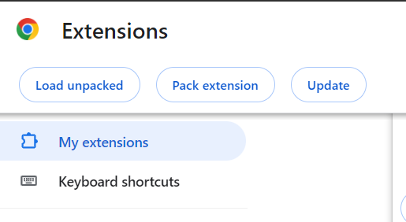
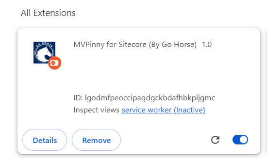

## Team name
⟹ Go Horse

## Category
⟹ Best use of AI

## Description
⟹ Write a clear description of your hackathon entry.  

  - Module Purpose : 
  This tool serves as a chat assistant specifically designed for content editors working with Sitecore. Its primary purpose is to facilitate a comprehensive understanding of Sitecore buttons and functionalities. Users can inquire about any aspect, and it is seamlessly connected to MVP Pinny, an AI model specialized in Sitecore, skillfully developed by the Go Horse Team.

  - How it works
    - This Chrome extension module resolves and supports content editors by seamlessly integrating Sitecore with artificial intelligence. It aids content authors by directly delivering answers to their questions.

## Video link
⟹ Provide a video highlighing your Hackathon module submission and provide a link to the video. You can use any video hosting, file share or even upload the video to this repository. _Just remember to update the link below_

⟹ [Replace this Video link](#video-link)

## Pre-requisites and Dependencies

⟹ Does your module rely on other Sitecore modules or frameworks?

- Chrome Browser 
- Compatible with any Sitecore version

## Installation instructions

 1. Install Chrome Browser
2. Download the GoHorse Chrome Extension on the url below 
 "https://github.com/Sitecore-Hackathon/2024-Go-Horse/tree/main/gohorse-chrome-extension" your local
3.  Open Google Chrome
Launch the Google Chrome browser on your computer.
4.  Navigate to the Chrome Extensions Management Page
In the address bar, type "chrome://extensions/" and press Enter.
5. Enable Developer Mode
In the top-right corner of the Extensions page, toggle the "Developer mode" switch to the ON position.

6. Locate and Click "Load Unpacked"
After enabling Developer mode, you will see additional options.
Click on the "Load unpacked" button.

7. Select Extension Folder
A file dialog will appear. Navigate to the folder where your locally hosted extension is located.
Select the folder containing your extension and click "Select Folder" or "Open."

8. Now you should see the "MVP for Sitecore
You will see the following Fields "OpenIA Key" and "model" Type your OpenAPI Key and click "Save"

if you don't have an API KEY , click on the document below 
- [Creating API Key instructions](CreatingAPIkey.md)
### Configuration
⟹ If there are any custom configuration that has to be set manually then remember to add all details here.

_Remove this subsection if your entry does not require any configuration that is not fully covered in the installation instructions already_

## Usage instructions
⟹ Provide documentation about your module, how do the users use your module, where are things located, what do the icons mean, are there any secret shortcuts etc.

Include screenshots where necessary. You can add images to the `./images` folder and then link to them from your documentation:

You can embed images of different formats too:

And you can embed external images too:

## Comments
If you'd like to make additional comments that is important for your module entry.
